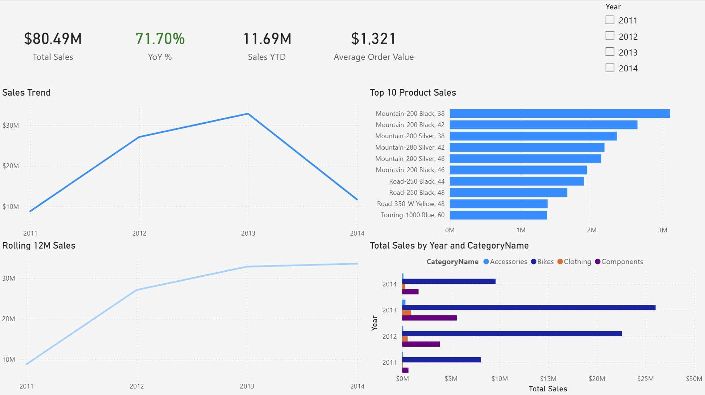

# Power BI Executive Sales Dashboard

This project is an executive-level Power BI dashboard built on AdventureWorks sales data.

The goal of the dashboard is to provide a clear, high-level view of sales performance while still allowing analytical drill-down when needed.

## Key Features
- KPI tracking: Total Sales, YoY Growth, Sales YTD, Average Order Value
- Year-over-year performance analysis
- Rolling 12-month sales trend
- Category-level contribution analysis
- Top 10 products by total sales
- Star schema data model with a dedicated Date dimension
- Optimized DAX measures for time intelligence

## Data Model
The dashboard is built using a star schema with:
- Fact table: Sales orders
- Dimensions: Date, Product, Product Category, Customer, Employee

A custom Date table is used instead of Power BI auto date/time.

## Tools & Technologies
- Power BI Desktop
- DAX (Time Intelligence, Ranking, KPIs)
- Power Query (data shaping)
- Dimensional modeling (Kimball)

## Screenshot

## Notes
This project is designed as a portfolio example for Power BI Analyst / BI Developer roles, focusing on business storytelling, model clarity, and executive usability.